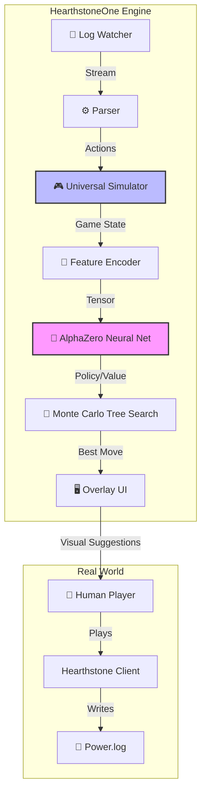
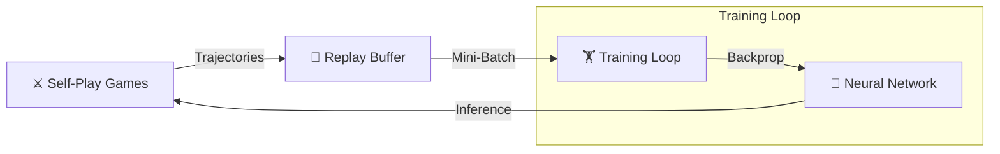

# HearthstoneOne AI 🎮🧠

**Assistant IA intelligent pour Hearthstone** - Suggestions de jeu en temps réel via overlay, entraînement automatisé par self-play.


---

## 🎯 Fonctionnalités
# 🃏 HearthstoneOne: Advanced AI & Coaching Assistant


**HearthstoneOne** n'est pas un simple bot. C'est un ecosystème complet d'Intelligence Artificielle capable d'atteindre un niveau surhumain via l'apprentissage par renforcement (**AlphaZero**) et d'assister les joueurs en temps réel grâce à une compréhension profonde du jeu.

---

## 🏗️ Architecture Système

HearthstoneOne agit comme une "paire d'yeux" augmentée par une IA. Voici comment les composants interagissent :



---

## 🧠 Le Cerveau : AlphaZero & MCTS

Le cœur du projet repose sur une réimplémentation fidèle de l'algorithme d'AlphaZero de DeepMind, adapté à l'espace d'action immense de Hearthstone.

### Cycle d'Apprentissage (Self-Play)

L'IA apprend en jouant des millions de parties contre elle-même, sans connaissance humaine a priori (Tabula Rasa).



*   **Réseau de Neurones (Actor-Critic)** :
    *   **Entrée** : État du plateau encodé en tenseur (Board, Main, Secrets, Historique).
    *   **Sortie Politique ($P$)** : Probabilité de chaque coup possible.
    *   **Sortie Valeur ($V$)** : Estimation de la probabilité de victoire (-1 à +1).

*   **Monte Carlo Tree Search (MCTS)** : Utilise le réseau pour guider la recherche, explorant les futurs possibles (State Cloning) pour sélectionner le coup le plus robuste.

---

## 🎮 Le Simulateur Universel

Pour entraîner une IA, il faut pouvoir simuler le jeu à une vitesse extrême. HearthstoneOne dispose de son propre moteur de règles, écrit en Python pur pour une flexibilité totale.

### Points Forts
*   **State Cloning** : Capacité unique de cloner l'état du jeu *parfaitement* à n'importe quel instant. Indispensable pour le MCTS.
*   **LLM-Generated Logic** : Les milliers de cartes et leurs effets complexes (Battlecry, Deathrattle) sont générés semi-automatiquement par des Modèles de Langage, garantissant une couverture rapide des nouvelles extensions.
*   **Factory Pattern** : Instanciation dynamique des cartes via `factory.py` pour supporter les cartes créées en cours de jeu (Discover, Add to hand).

---

## 👁️ Live Assistant & Parser

Le module `runtime/` fait le pont entre le jeu réel et l'IA.

1.  **LogWatcher** : Surveille `Power.log` en temps réel, détectant instantanément les nouvelles lignes.
2.  **Parser Intelligent** :
    *   Décode les tags cryptiques (`ZONE`, `DAMAGE`, `PLAYSTATE`).
    *   Reconstruit la main de l'adversaire (comptage de cartes).
    *   Détecte les offres de **Discover/Choose One** (`Zone.SETASIDE`) pour permettre à l'IA de conseiller le meilleur choix.

---

## 🚀 Guide de Démarrage

### 1. Installation
```bash
git clone https://github.com/Kevzi/-HearthstoneOne.git
cd HearthstoneOne
pip install -r requirements.txt
```

### 2. Lancer l'Assistant (Mode Live)
Lancez Hearthstone, puis exécutez :
```bash
python runtime/test_log_reader.py
```
*Le script détectera automatiquement votre installation Hearthstone et commencera à décoder la partie.*

### 3. Entraîner l'IA
Pour lancer une session d'auto-apprentissage (Self-Play) :
```bash
python training/trainer.py
```

### 4. Évaluation
Testez la force de votre modèle actuel :
```bash
python evaluation.py
```

---

## 📂 Organisation du Code

| Dossier | Rôle | Composants Clés |
| :--- | :--- | :--- |
| `ai/` | Cerveau Artificiel | `mcts.py`, `model.py`, `encoder.py` |
| `simulator/` | Moteur Physique | `game.py`, `player.py`, `factory.py` |
| `training/` | Gym d'Entraînement | `trainer.py`, `data_collector.py` |
| `runtime/` | Interface Jeu | `log_watcher.py`, `parser.py` |
| `docs/` | Documentation | `TASKS.md`, `CHANGELOG.md` |

---

*HearthstoneOne est un projet open-source conçu pour la recherche et l'éducation.*
├── training/              # ️ Entraînement
│   └── self_play.py       # Boucle de jeu autonome
├── docs/                  #  Documentation
│   ├── TASKS.md           # Suivi des tâches
│   ├── CHANGELOG.md       # Historique
│   └── ARCHITECTURE.md    # Design technique
├── tests/                 # ✅ Tests Unitaires
├── data/                  # � Données (DB, Logs)
├── requirements.txt       # Dépendances
└── main.py                # Point d'entrée
```

---

## 🛠️ Technologies Utilisées

### Core
| Technologie | Usage | Pourquoi |
|-------------|-------|----------|
| **Python 3.10+** | Langage principal | Ecosystème ML |
| **PyTorch 2.0+** | Neural Networks | Performance, flexibilité, communauté |
| **ONNX Runtime** | Inférence production | Optimisation GPU, cross-platform |

### Simulateur
| Technologie | Usage | Pourquoi |
|-------------|-------|----------|
| **Custom Universal Simulator** (`simulator/`) | Moteur de jeu complet | Supporte TOUTES les cartes modernes, effets générés par LLM |
| **LLM-Driven Effects** | Génération de code | Implémentation rapide de 1000+ cartes |

### UI
| Technologie | Usage | Pourquoi |
|-------------|-------|----------|
| **PyQt6** | GUI + Overlay | Natif Windows, transparent windows |
| **Matplotlib** | Graphiques stats | Simple, intégré PyQt |

### API & Data
| Technologie | Usage | Pourquoi |
|-------------|-------|----------|
| **FastAPI** | API REST | Moderne, async, auto-docs |
| **SQLAlchemy** | ORM Database | Flexible, SQLite support |
| **SQLite** | Base de données | Léger, pas de serveur |

### Monitoring
| Technologie | Usage | Pourquoi |
|-------------|-------|----------|
| **Watchdog** | File watching | Surveillance Power.log |
| **TensorBoard** | Training metrics | Visualisation entraînement |

---

## 🚀 Installation

### Prérequis
- Python 3.10+
- CUDA 11.8+ (optionnel, pour GPU)
- Hearthstone installé (pour l'overlay)

### Setup

```bash
# Cloner le repo
git clone https://github.com/YOUR_USERNAME/HearthstoneOne.git
cd HearthstoneOne

# Créer environnement virtuel
python -m venv venv
venv\Scripts\activate  # Windows

# Installer dépendances
pip install -r requirements.txt
```

---

## 📖 Usage

### Lancer la GUI
```bash
python main.py
```

### Lancer l'API seule
```bash
uvicorn api.main:app --reload
```

### Entraînement self-play
```bash
python -m training.trainer --games 10000 --workers 4
```

---

## 📊 API Endpoints

| Endpoint | Méthode | Description |
|----------|---------|-------------|
| `/predict` | POST | Obtenir la meilleure action |
| `/mulligan` | POST | Conseils de mulligan |
| `/meta` | GET | Decks meta actuels |
| `/stats` | GET | Statistiques du joueur |

---

## 🔧 Configuration

Créer `config.yaml` :
```yaml
hearthstone:
  log_path: "C:/Users/YOU/AppData/Local/Blizzard/Hearthstone/Logs"

overlay:
  opacity: 0.9
  position: "top-right"

training:
  games_per_iteration: 1000
  workers: 4

inference:
  device: "cuda"  # ou "cpu"
  model_path: "models/latest.onnx"
```

---

## 📝 Notes

> **💡 Recommandation** : Installer [Hearthstone Deck Tracker](https://hsreplay.net/downloads/) pour les replays et statistiques détaillées.

---

## 📜 License

MIT License - Voir [LICENSE](LICENSE)

---

## 🤝 Contributing

Les contributions sont bienvenues ! Voir [CONTRIBUTING.md](CONTRIBUTING.md)
